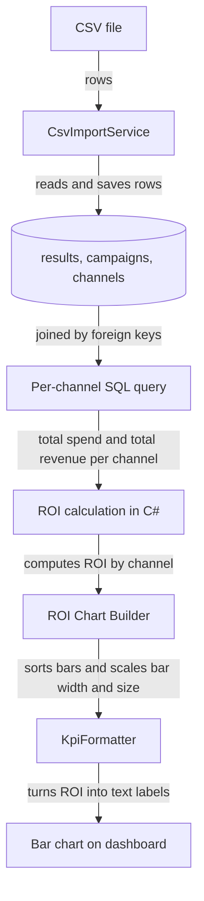

## Data flow diagram for PBI 6

```mermaid
flowchart TD
    A[CSV file] --> |rows|B[CsvImportService]
    B --> |reads and saves rows|C[(results, campaigns, channels)]
    C --> |joined by foreign keys|D[Per-channel SQL query]
    D --> |total spend and total revenue per channel|E[ROI calculation in C#]
    E --> |computes ROI by channel|F[ROI Chart Builder]
    F --> |sorts bars and scales bar width and size|G[KpiFormatter]
    G --> |turns ROI into text labels|H[Bar chart on dashboard] 

```